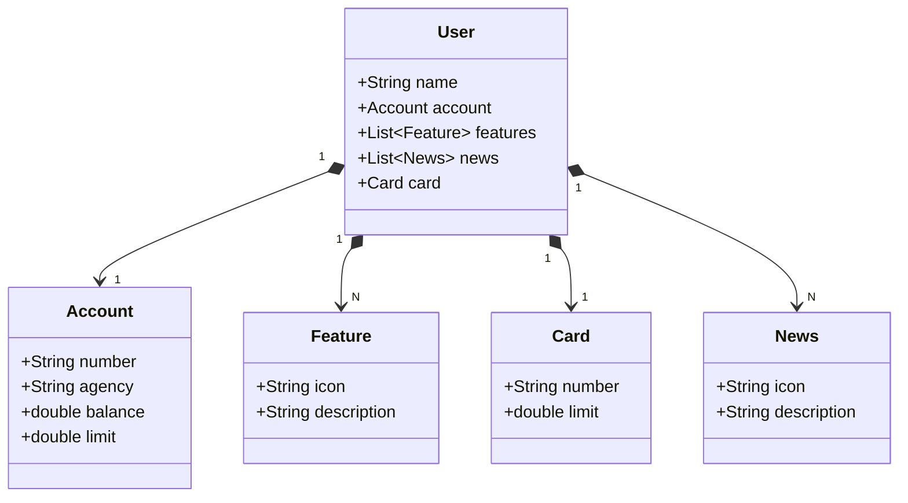

# ✅ Publicando Sua API REST na Nuvem Usando Spring Boot 3, Java 17 e Railway
### ✅ Publishing Your REST API to the Cloud Using Spring Boot 3, Java 17, and Railway

### Como usar:  
### How to use:
```
Projeto Funcionando somente com H2 DataBase
Project Working Only with H2 Database

Projeto dando Erro no PostgreSQL
Project Giving Error in PostgreSQL
```

## 📋 Linguagem usada : (Language used)


## 📋 Framework usada : (Framework used)


## 📋 Dependencias usadas : (Dependencies used)


- JPA Repository
- H2 Data Base
- Spring Web
- PostgreSQL (error)

## 🕹 Gerenciador: (Package manager)


## 💻 IDE Usada para Cria-lo: (IDE used to create it)


## 💬  Contatos: (Contacts)
   

[Meu LinkedIn](<www.linkedin.com/in/amrocha1>) ---  [Meu GitHub](<https://github.com/amrocha1>)

## 👨‍💻 Tecnologias Uteis: (Useful Technologies)


###   [@amrocha1](https://www.linkedin.com/in/amrocha1/)


## Diagrama de Classes


